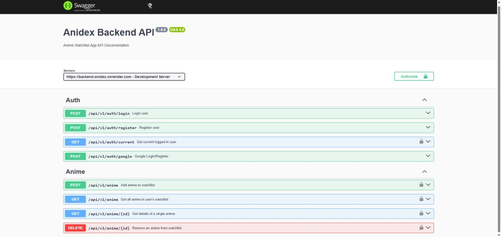

# 🚀 AniDex API

<div align="center">
  
  <br />
  <p>
    <strong>Lightweight backend for an anime discovery platform.</strong>
  </p>
  <a href="https://backend-anidex.onrender.com/api-docs/">🚀 Swagger Documentation</a> •
  <a href="https://github.com/Tanju67/frontend-anidex">📂 frontend repo</a>
</div>

---

## 📝 Overview

AniDex API is a backend built with Node.js, Express, and TypeScript.

It provides authentication, user management, and watchlist functionality for the AniDex platform. Users can register, log in, and manage their personal anime watchlist.

---

## ✨ Features

- JWT-based authentication
- Google OAuth login
- Watchlist system (add/remove anime)
- MongoDB integration with Mongoose
- Request validation using Zod
- REST API architecture
- Swagger API documentation

---

## 🧠 Architecture

- MVC pattern (Controller / Service / Model separation)
- Centralized error handling middleware
- Reusable authentication middleware
- Clean separation of concerns

---

## 🔐 Authentication & Security

- JWT is used for authentication
- Google OAuth as an alternative login method
- Protected routes for authorized users
- Validation layer for request safety

---

## 🛠 Tech Stack


---

## How to get the project:

#### Using Git (recommended)

1. Navigate & open CLI into the directory where you want to put this project & Clone this project using this command.

```bash
git clone https://github.com/Tanju67/backend-anidex.git

```

#### Using manual download ZIP

1. Download repository
2. Extract the zip file, navigate into it & copy the folder to your desired directory

## Setting up environments

1. Create the backend url in a .env file.

```bash
MONGO_URI=(your mongo uri)
JWT_SECRET= (create your key)
JWT_LIFETIME=(create your key)
PORT=(set your port number)
GOOGLE_CLIENT_ID=(your google client id)
GOOGLE_CLIENT_SECRET=(your google client secret)
```

2. Install NPM packages.

```bash
cd backend-anidex
npm install
```

3. Start the server .

```bash
npm run dev
```
